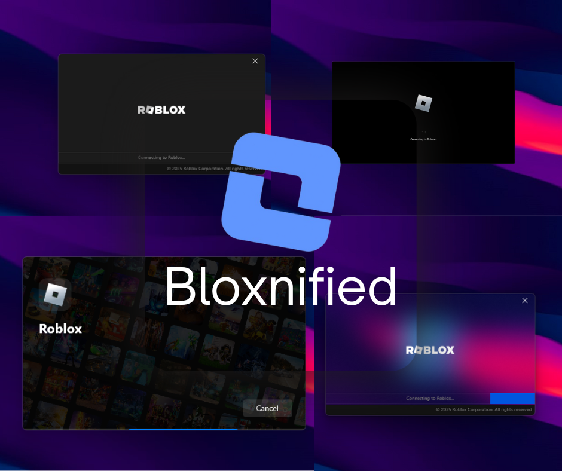
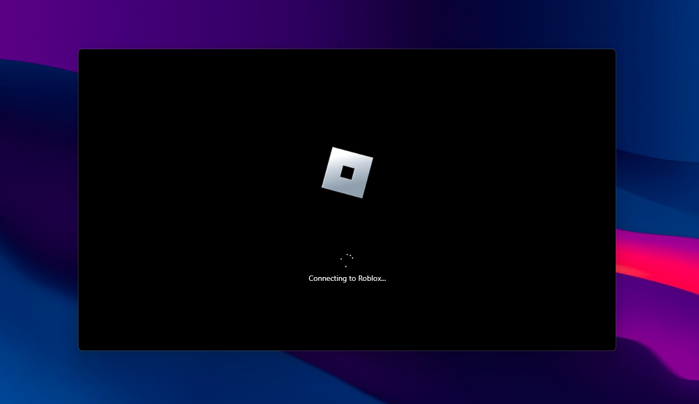
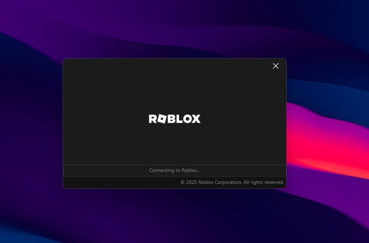
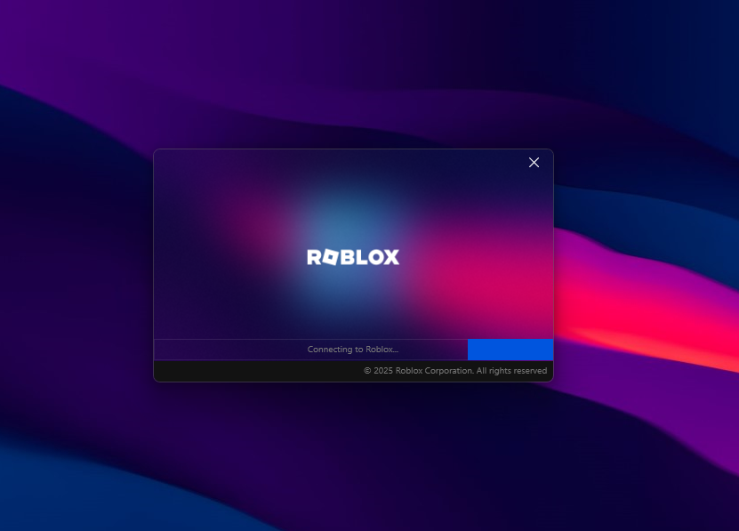
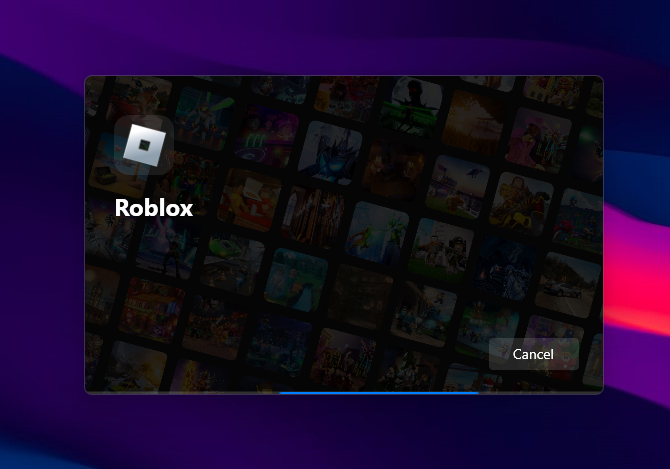

	

# Bloxnified

	
	
	
	
	
	

Modernized Roblox bootstrappers for Bloxstrap & Fishstrap — a curated collection of themed bootstrappers (Windows 10, SynapseX-inspired, Aero, and Steam-like) ready to import.

A compact set of theme packages and assets you can import into Bloxstrap or Fishstrap to give the Roblox launcher a modernized look.

## What this is

Bloxnified provides ready-made theme folders (Theme.xml plus images) that modernize the appearance of the Roblox bootstrapper. Each top-level folder (`V1/`, `V2/`, `V2-Aero/`, `V3/`) contains a theme package — swap these into your bootstrapper or use them as a starting point for your own design.

## Features

- Lightweight theme packs (XML + images)
- Multiple style variants (classic, aero-style, modern)
- Easy to customize: replace images or edit `Theme.xml`

## Repository structure

- `V1/` — Windows 10 themed version of Roblox's launcher
- `V2/` — Theme inspired by the SynapseX launcher
- `V2-Aero/` — Aero-style variant of V2
- `V3/` — Modernized, Steam-like UI for the Roblox launcher
- `LICENSE` — Project license

Open any of the theme folders to inspect the XML and image assets.

## Screenshots

Below are preview placeholders for each version. Add the matching images to `screenshots/` (see names below) and they will render here.

### V1 — Windows 10 theme

	

### V2 — SynapseX-inspired

	

### V2-Aero — Aero-style variant

	

### V3 — Modern / Steam-like UI

	

## Quick install

1. Go to the Releases page for this repository and download any release (each release contains a zip of the bootstrappers).
2. Open Bloxstrap or Fishstrap.
3. Navigate to Appearance > Bootstrappers.
4. Under Bootstrappers: set the bootstrapper's style to "Custom", click the "New" button, then choose Import and select the zip file you downloaded. For Fishstrap the flow is similar — use the Appearance/Bootstrappers section and import the zip.
5. Save your changes.

Notes:
- If you prefer to inspect or modify theme files manually, extract the zip and copy the theme folder you want into your bootstrapper's assets, or edit `Theme.xml` directly.
- Different bootstrappers may expect slightly different XML schema or asset names. If your bootstrapper uses different filenames, either rename the files here or update `Theme.xml` to point to your existing asset names.
- V1 and V3 logos can be customized via Bloxstrap/Fishstrap's settings (Appearance > Bootstrappers > [selected theme] > Logo or similar).

## Customization tips

- Replace `Logo.png`, `Background.png`, or `bg.png` with your image (keep aspect ratio and reasonable file sizes).
- Edit `Theme.xml` to tweak colors, text, and layout.
- Animate small assets as GIFs for loading indicators (keep the file size small).

## Contributing

Contributions are welcome. Please open an issue or submit a pull request with:

- New theme folders or improvements to existing themes
- Fixes to `Theme.xml` layout/values
- Optimized images (smaller file sizes without visible quality loss)

## Credits

- Project author: Svznify
- Inspired by the Bloxstrap and Fishstrap community.
- Members who may have made the themes before me, Credits to them

---

If you want a new theme variant or help wiring a theme into a specific bootstrapper, open an issue and include which bootstrapper (Bloxstrap or Fishstrap) and which theme folder you want adapted.
